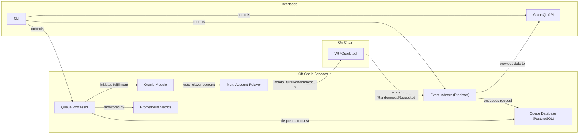
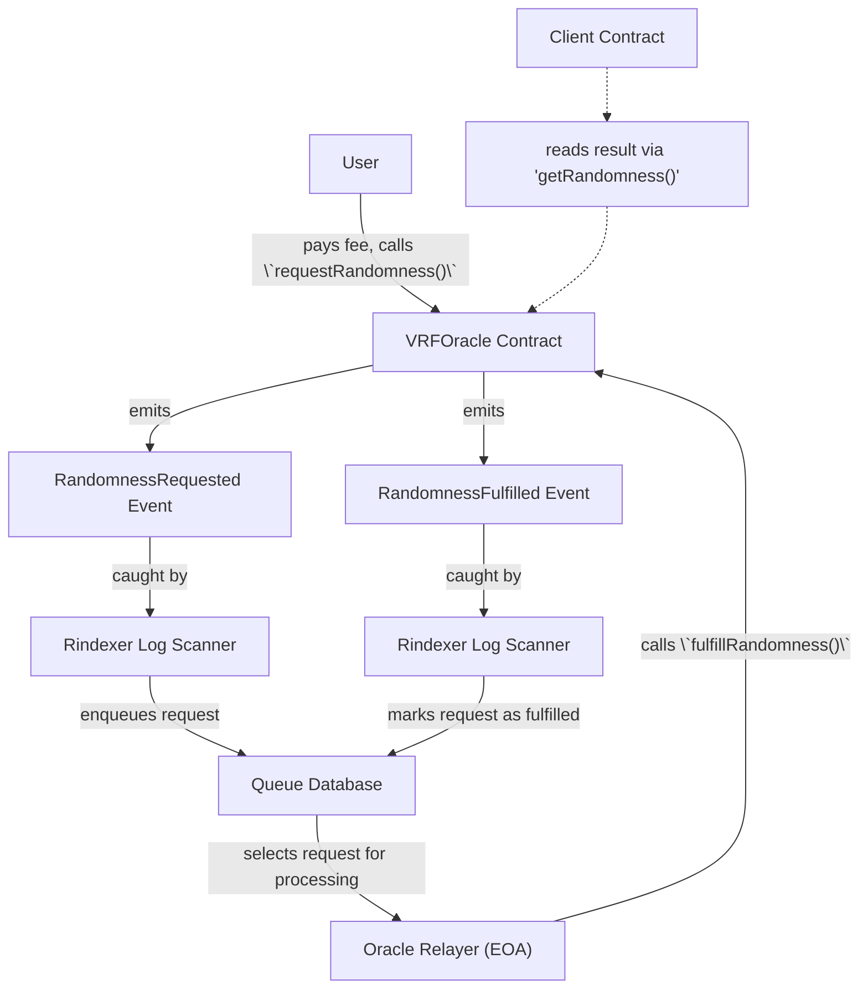
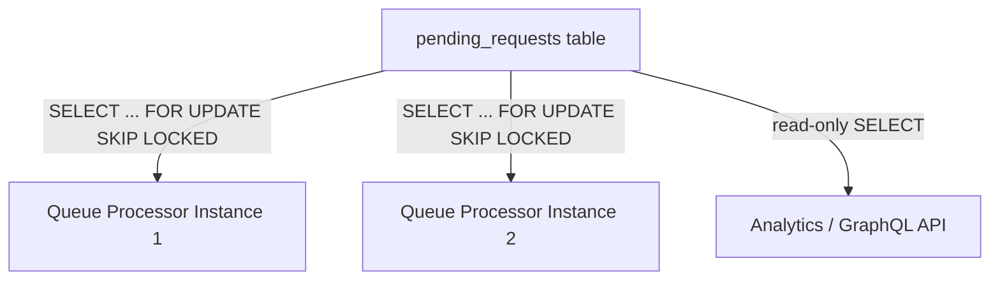
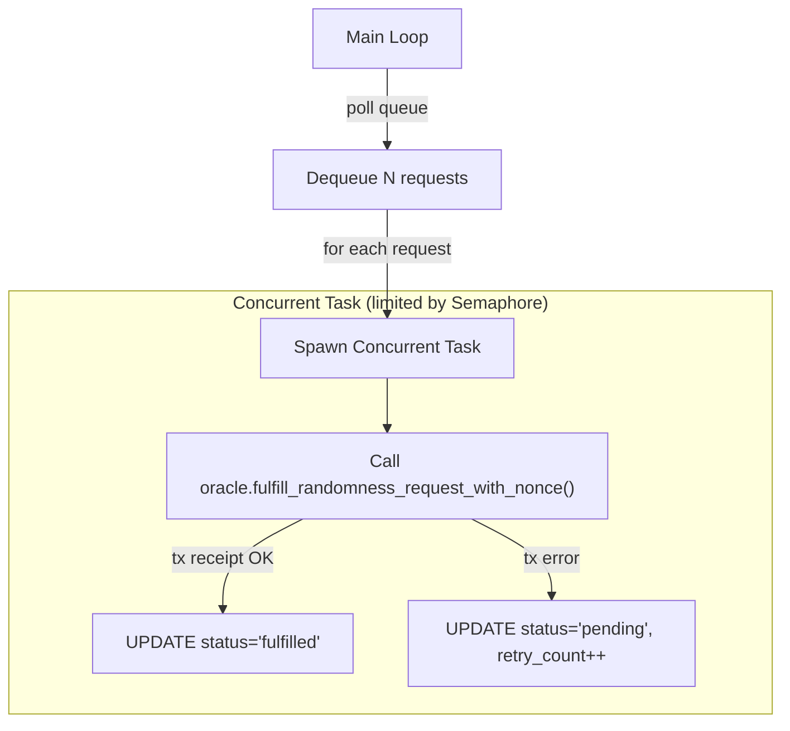
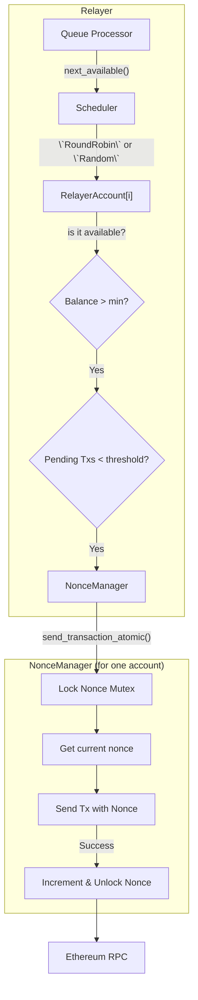

# ZamaOracle Architecture Overview

> **Version:** 1.0 (Generated from Codebase)
> **Scope:** This document outlines the end-to-end architecture of the ZamaOracle service, covering the on-chain contract, off-chain services for event indexing and request fulfillment, and the underlying design principles for reliability and scalability.

---

## 1. High-Level Architecture

The ZamaOracle system is an event-driven architecture designed for robust and reliable delivery of verifiable randomness. The core workflow is decoupled into several specialized components that communicate through a persistent queue.

Data flows clockwise: a user transaction on the `VRFOracle` contract emits an event, which is captured by the indexer. The request is placed in a durable queue. The queue processor picks up the request, uses the oracle module to generate randomness, and submits the fulfillment transaction back to the contract via a multi-account relayer.

---

## 2. Component Deep Dives

### 2.1. Smart Contract (`contracts/oracle.sol`)

The on-chain component is a minimalist and gas-efficient Solidity contract that serves as the public interface for the VRF service.

**Design Rationale:**

- **Event-Driven:** The contract communicates with the off-chain world exclusively through events (`RandomnessRequested`, `RandomnessFulfilled`). Off-chain services don't need to poll the contract state, they just listen for events to process them.
- **Permissioned Fulfillment:** Only a designated `oracle` address can call `fulfillRandomness`, ensuring that only the trusted off-chain service can provide results. For a pure VRF we could think of a trustless service that emits proofs based on SECP256k1 (implementation of algorithm [draft-irtf-cfrg-vrf-05](https://datatracker.ietf.org/doc/draft-irtf-cfrg-vrf-05/)).

**Assumptions & Scaling to Production:**

- **Trust Model:** Assumes a whitelisted set of trusted `oracle` addresses. This is a centralization risk for production scenarios that should properly be mitigated (e.g. multisig wallet? MPC?)
- **Fee Mechanism:** Uses a static `fee` set by the owner. A production system would need a dynamic fee mechanism that accounts for fluctuating gas prices and can react to market conditions.

### 2.2. Event Indexer (`src/rindexer_lib`)

The indexer is the bridge between the on-chain and off-chain worlds. It listens for contract events and triggers the first step of the off-chain workflow.

**Design Rationale:**

- **Rindexer Framework:** Built on `rindexer`, which provides a declarative way to define event listeners and handlers in a typesafe way by generating type bindings from the contract's ABI.
- **Decoupling:** The indexer's sole responsibility is to reliably ingest on-chain events and enqueue them. It does **not** perform the fulfillment logic itself. This separation of concerns makes the system more resilient; if the fulfillment service is down, requests are safely queued and not lost.
- **Performance:** The handler uses `rindexer`'s bulk insert capabilities. When many events are processed in a batch, it uses PostgreSQL's efficient `COPY` command, significantly reducing database latency compared to individual `INSERT` statements.

**Assumptions & Scaling to Production:**

- **Single Instance:** Assumes a single indexer instance is running. For high availability, multiple stateless indexer instances can be run, coordinated by a distributed lock or a message queue to prevent duplicate processing of blocks.
- **Re-org Handling:** `rindexer` handles shallow re-orgs. For production on chains like Ethereum Mainnet, the confirmation block depth should be configured to a safe value (e.g., 6-12 blocks) to minimize the chance of indexing orphaned blocks. However, this introduces a delay in the system, which is not ideal for a VRF service. For deeper reorgs, we could think of using a Reth ExEx approach, discarding temporary state in case of reorgs.

### 2.3. Queue Database (`pending_requests` in PostgreSQL)

The database queue is the durable heart of the system, ensuring that every request is processed exactly once.

**Schema Highlights:**

| Column                  | Purpose                                                                                 |
| ----------------------- | --------------------------------------------------------------------------------------- |
| `status`                | Tracks the request lifecycle: `pending`, `processing`, `fulfilled`, `failed`.           |
| `retry_count`           | Enables exponential back-off and prevents infinite processing loops.                    |
| `processing_started_at` | Used to detect and re-queue jobs that are stuck in the `processing` state for too long. |
| `last_error`            | Stores the error message from the last failed attempt for debugging.                    |

**Design Rationale:**

- **Durability:** Using a transactional database like PostgreSQL guarantees that once a request is enqueued, it will not be lost, even if the application crashes.
- **Concurrent Processing:** The `FOR UPDATE SKIP LOCKED` clause is a powerful PostgreSQL feature that allows multiple queue processor instances to safely grab different pending jobs from the table without blocking each other. This is the key to horizontal scaling of the fulfillment service.

**Assumptions & Scaling to Production:**

- **Polling:** The queue processor polls the database at a set interval. For a high-throughput system, this can be optimized by using PostgreSQL's `LISTEN/NOTIFY` feature, where the database actively notifies processors when a new job is inserted, eliminating polling latency.
- **Archiving:** The `pending_requests` table will grow indefinitely. A production system should have an archiving strategy to move old `fulfilled` or `failed` requests to a separate table to keep the active queue lean and performant.
- **Database Scalability:** Assumes a single PostgreSQL instance. For production, a managed, high-availability database cluster (e.g., Amazon RDS, Google Cloud SQL) with read replicas for analytics is essential.

### 2.4. Queue Processor (`src/queue_processor.rs`)

This service is the worker that drives fulfillment. It fetches pending requests from the queue and orchestrates their completion.

**Design Rationale:**

- **Concurrency Control:** Uses a `tokio::sync::Semaphore` to limit the number of requests being processed in parallel (`max_concurrent_requests`). This prevents overwhelming the relayer accounts.
- **Resilience:** The processor is stateless; all state is in the database. If it crashes, it can be restarted, and it will simply pick up where it left off, retrying any jobs that were in a `processing` state for too long.
- **Retry Logic:** Failed attempts (e.g., due to temporary RPC errors or a relayer account running out of gas) are not terminal. The request is marked for retry, and the error is logged. This makes the system resilient to transient failures.

**Assumptions & Scaling to Production:**

- **Stuck Job Detection:** Relies on a timeout to re-queue jobs. A more sophisticated approach could involve a separate "janitor" process or using a job queue library that has this feature built-in.
- **Dead-Letter Queue:** After a maximum number of retries, a request is marked as `failed` and left in the table. A production system should move these to a separate "dead-letter queue" for manual inspection and potential replay.
- **Horizontal Scaling:** The design allows for running multiple processor instances on different machines, all pointing to the same database. The `SKIP LOCKED` pattern ensures they work together efficiently.

### 2.5. Multi-Account Relayer & Nonce Management (`src/relayer`, `src/provider.rs`)

The relayer is responsible for the final, critical step: submitting the fulfillment transaction to the blockchain. It manages a pool of EOA (Externally Owned Account) wallets to do this reliably and at scale.

**Design Rationale:**

- **High Throughput & Reliability:** Using a pool of accounts instead of a single one provides several advantages:
  1.  **Parallelism:** Multiple transactions can be in flight simultaneously across different accounts.
  2.  **Nonce Resilience:** If one account has a stuck transaction (a transaction with a low gas fee that isn't being mined), other accounts can continue processing requests. A single-account system would be completely blocked.
  3.  **Gas Management:** If one account runs low on gas, the system automatically switches to others.
- **Account Scheduling:**
  - **Round-Robin (Default):** A simple and fair strategy that cycles through the available accounts, evenly distributing the load.
  - **Random:** An alternative that can also distribute load effectively.
    The scheduler first selects an account, then checks its availability (sufficient gas, not too many pending transactions) before using it.
- **Atomic Nonce Management:** The `NonceManager` is critical for preventing transaction failures. For a single EOA, all transactions must have sequential nonces. The `send_transaction_atomic` function ensures this atomicity by:
  1.  Acquiring a `Mutex` lock on the nonce.
  2.  Retrieving the current nonce value.
  3.  Submitting the transaction with that nonce to the RPC endpoint.
  4.  **Only after the transaction is successfully sent**, it increments the nonce and releases the lock.
      This prevents a "nonce gap" where a transaction fails to be sent, but the nonce is still incremented, causing all subsequent transactions to fail.

**Assumptions & Scaling to Production:**

- **Key Management:** Private keys are loaded from environment variables. For production, these keys must be stored securely in a vault (e.g. AWS KMS) and accessed by the relayer service with strict IAM policies.
- **Gas Price Strategy:** The relayer currently submits transactions with the default gas price from the RPC provider. A production-grade relayer needs a sophisticated gas price escalation strategy (EIP-1559 priority fees, transaction replacement/cancellation) to ensure timely inclusion of transactions.
- **Account Funding:** Assumes accounts are funded manually. A production system requires an automated process to monitor account balances and top them up when they fall below a certain threshold.
- **Relayer Account Management:** There is no recovery mechanism in case an account is stuck because of a transaction that's not properly processed.

### 2.6. GraphQL API & CLI

- **GraphQL API:** `rindexer` automatically generates a GraphQL server, providing a read-only interface to query the indexed event data. This is useful for analytics, monitoring, and building front-end dashboards.
- **CLI (`main.rs`, `cli.rs`):** The application is packaged as a flexible command-line tool. It allows operators to run all services together (`run`) for simple deployments or to run each component (`indexer`, `queue-processor`, `graphql`) as a separate process for distributed, scalable deployments.

---

## 3. Production Readiness Checklist

This table summarizes the key areas that need to be addressed to move the ZamaOracle from its current state to a production-ready system on a public blockchain.

| Area                   | Current Implementation             | Production Requirement                                                                                  |
| ---------------------- | ---------------------------------- | ------------------------------------------------------------------------------------------------------- |
| **Cryptography**       | `OsRng` for pseudorandomness       | Integrate a true VRF scheme (e.g., ECVRF) with on-chain proof verification.                             |
| **Oracle Trust Model** | Single hot key in `.env`           | Use a hardware security module (HSM) or a vault. Implement staking/slashing.                            |
| **Chain Finality**     | Immediate (assumes Anvil)          | Wait for a safe number of block confirmations (e.g., 6-12) before fulfilling.                           |
| **Network Support**    | Single network (`anvil`)           | Configure for multiple networks (mainnet, testnets) with RPC load balancing.                            |
| **Database**           | Local PostgreSQL instance          | Managed, high-availability PostgreSQL cluster with backups and read replicas.                           |
| **Observability**      | Prometheus metrics for relayer     | Add structured logging (e.g., JSON), distributed tracing (OpenTelemetry), and error reporting (Sentry). |
| **Security**           | Unauthenticated GraphQL API        | Implement authentication/authorization (e.g., API keys, JWT) and rate limiting.                         |
| **Relayer**            | Basic gas handling, manual funding | Implement EIP-1559 gas strategies, automated account funding, and transaction replacement.              |
| **Throughput**         | Tested for low-volume scenarios    | Benchmark against expected load; implement autoscaling for indexers and processors.                     |

---

## 4. Roadmap to Mainnet

1.  **Cryptographic Upgrade:** Replace `generate_random_value` with a verifiable VRF implementation and add the corresponding `verify` function to the smart contract.
2.  **Multi-Network Deployment:** Enhance the `rindexer` manifest and deployment scripts to support mainnet and major testnets.
3.  **Security Hardening:**
    - Move private keys to a secure vault.
    - Undergo a third-party security audit of the smart contracts and off-chain code.
4.  **Economic Model & Governance:**
    - Implement a dynamic fee model.
    - Design and implement a staking contract for oracle operators.
5.  **Autoscaling & Infrastructure:**
    - Containerize all services (Dockerfile, etc.).
    - Create Kubernetes manifests or Terraform scripts for automated, scalable deployment.
    - Set up Horizontal Pod Autoscalers (HPAs) for queue processors based on queue length.
