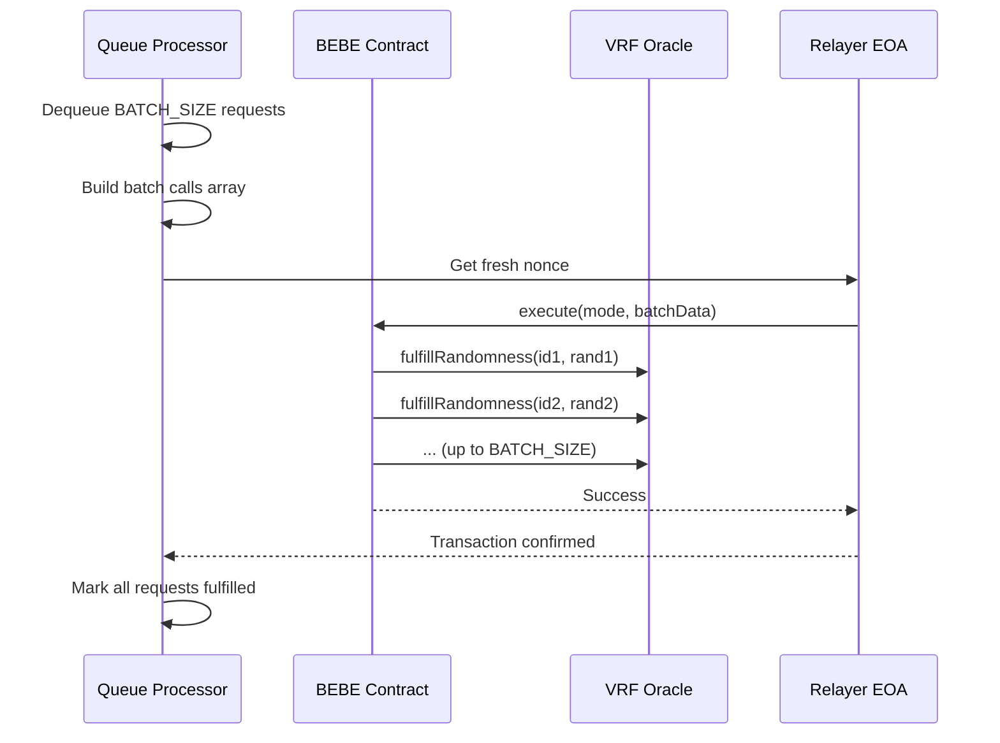

# Batch Processing via EIP-7702/ERC-7821

## Overview

The ZamaOracle now supports efficient batch processing of randomness requests using EIP-7702 (EOA code execution) and ERC-7821 (minimal batch executor standard). This feature dramatically reduces gas costs and increases throughput by fulfilling multiple requests in a single transaction.

## Key Benefits

- **90% Gas Reduction**: Process 10 requests for the cost of ~1.5 single transactions
- **Higher Throughput**: No more nonce bottlenecks - one transaction fulfills many requests
- **Cleaner Architecture**: Simplified nonce management at the batch level
- **Backward Compatible**: Falls back to single-request mode if not configured

## How It Works

1. **BEBE Contract**: The Basic EOA Batch Executor (BEBE) implements ERC-7821's `execute` function
2. **EIP-7702 Authorization**: Each relayer EOA authorizes the BEBE contract to execute on its behalf
3. **Smart Batching**:
   - Processes immediately when queue ≥ BATCH_SIZE requests
   - Processes partial batches after 0.5s timeout
   - Scales processing with available relayers
4. **Batch Encoding**: Multiple `fulfillRandomness` calls are ABI-encoded into a single batch
5. **Single Transaction**: The batch is executed atomically through BEBE



## Configuration

### Environment Variables

```bash
# Enable batch processing by setting BEBE address
BEBE_ADDRESS=0x... # Address of deployed BEBE contract

# Configure batch size (default: 10)
BATCH_SIZE=10

# Relayer accounts (all will be authorized for BEBE)
RELAYER_PRIVATE_KEYS=0xkey1,0xkey2,0xkey3
```

### Deployment

The deployment script automatically:

1. Deploys the BEBE contract
2. Authorizes all relayer EOAs via EIP-7702
3. Saves the BEBE address to `.env`

```bash
npm run deploy
```

## Testing

Run the batch integration test to verify the system processes requests in batches:

```bash
npm run test:batch
```

The test will:

- Create 25 randomness requests
- Start the queue processor with BATCH_SIZE=10
- Verify exactly 3 fulfillment transactions are sent
- Confirm all 25 requests are fulfilled

## Metrics

New Prometheus metrics for monitoring batch processing:

- `relayer_batch_fulfilled_total`: Total number of batch transactions
- `batch_size`: Histogram of actual batch sizes processed

## Implementation Details

### Database Changes

- `dequeue_requests(limit)`: Bulk dequeue with `FOR UPDATE SKIP LOCKED`
- `mark_batch_failed(ids, error)`: Bulk update for failed batches

### Oracle Module

- `build_batch_calls()`: Generates random values and encodes calls
- `encode_batch_for_erc7821()`: ABI encodes for ERC-7821 execution

### Relayer Changes

- `send_batch()`: Executes batch through BEBE with fresh nonce
- `next_available_batch()`: Selects accounts with BEBE configured

### Queue Processor

- Detects BEBE configuration automatically
- Requires BEBE to be configured (no fallback to single-request mode)
- Smart batching strategy:
  - Immediate processing when queue ≥ BATCH_SIZE
  - Timeout-based processing for partial batches (0.5s)
  - Concurrent batch processing based on available relayers
- Natural backpressure through relayer availability

## Production Considerations

1. **Batch Size Tuning**:
   - Monitor block gas limits
   - Adjust based on network congestion
   - Consider dynamic sizing based on queue depth

2. **Error Handling**:
   - Entire batch fails atomically
   - All requests in failed batch are retried
   - Consider partial batch retry strategies

3. **Gas Optimization**:
   - Larger batches = better amortization
   - But risk hitting block gas limits
   - Sweet spot typically 10-50 requests

4. **Monitoring**:
   - Track batch success rates
   - Monitor gas usage per request
   - Alert on batch failures

## Future Improvements

- Dynamic batch sizing based on queue depth
- Partial batch retry on specific errors
- Multi-BEBE deployment for different gas strategies
- Cross-chain batch fulfillment
