# Building a Resilient VRF Oracle in Rust

A chronological journey from a simple indexer to a sophisticated, high-throughput system (as much as you can achieve in a day and a half...).

  
    Go To Presentation <carbon:arrow-right class="inline"/>
  

  <a href="https://github.com/zama-ai/zama-oracle" target="_blank" alt="GitHub" title="Open in GitHub"
    class="text-xl slidev-icon-btn opacity-50 !border-none !hover:text-white">
    <carbon-logo-github />
  </a>

<!--
This presentation chronicles the real-world evolution of the ZamaOracle system, showing how architectural decisions evolved from a simple MVP to a sophisticated, production-ready system capable of handling high throughput with modern Ethereum features.
-->

---
transition: fade-out
---

# What is a VRF Oracle?

A **Verifiable Random Function (VRF) Oracle** provides cryptographically secure and verifiable randomness to smart contracts.

### The Challenge

- Blockchains are deterministic.
- `block.timestamp` and `block.hash` are not secure sources of randomness.
- On-chain games, NFTs, and protocols need unpredictable outcomes.

### The Solution

An **Oracle**: a trusted off-chain system that listens for on-chain requests, computes a value (in this case, randomness), and securely delivers it back on-chain.

How to build such a system from the ground up.

<!--
VRF Oracles are critical infrastructure for blockchain applications that need secure randomness. The challenge is building a system that's both cryptographically secure and operationally reliable, scalable, and fast.
-->

---
transition: slide-up
---

# The Evolution Timeline

Four major iterations that transformed a simple indexer into a something that deserves the name "oracle".

*The real complexity: C++ toolchain on Mac...*

<!--
This timeline shows the four major evolutionary phases of the oracle system, each solving critical production challenges that emerged as the system scaled.
-->

---
layout: section
background: https://images.unsplash.com/photo-1551288049-bebda4e38f71?ixlib=rb-4.0.3&auto=format&fit=crop&w=2340&q=80
---

# Phase 1: The Genesis
## The Minimum Viable Product: An Event Indexer

  
🌱

  
Just listening.

<!--
Every great system starts with an MVP. The ZamaOracle began as a simple event indexer - the foundation that would eventually support a production-grade oracle system.
-->

---
layout: two-cols
---

# MVP Architecture

The initial version is a one-way street: from the chain to the database.

**Core Components:**
- **`VRFOracle.sol`**: A smart contract that emits a `RandomnessRequested` event.
- **`Rindexer` Library**: An off-chain service that listens for these events.
- **PostgreSQL**: A database to store the event data.

---
layout: two-cols
---

**The Workflow:**
1. User calls `requestRandomness()` on the smart contract.
2. The contract emits a `RandomnessRequested` event.
3. The `Rindexer` service catches the event.
4. The event handler saves the request details into a PostgreSQL table.

::right::

**Limitations of the MVP:**
- ❌ **No Fulfillment**: The oracle only logs requests; it never fulfills them.
- ❌ **No Action**: It's a passive listener, not an active participant.
- ✅ **Foundation**: It establishes a link between the on-chain and off-chain worlds.

---
layout: section
background: https://images.unsplash.com/photo-1518314916381-77a37c2a49ae?ixlib=rb-4.0.3&auto=format&fit=crop&w=2340&q=80
---

# Phase 2: Building Resilience
## From Fragile Script to Durable System

  
🛡️

  
Making it robust.

---
layout: two-cols-header
---

## The Problem: A Brittle System

A naive fulfillment implementation (`event -> fulfill transaction`) is doomed to fail.

### No State Persistence
If the oracle service crashes or restarts, any requests that were being processed are lost forever.

```mermaid {scale: 0.45}
graph TD
    A[Event Received] --> B{Process Request}
    B --> C{Send Tx}
    C --> D[Crash! 💥]
    E[Request Lost]
```

### The Nonce Nightmare
If a transaction gets stuck (e.g., low gas), all subsequent transactions from that account will fail until the stuck one is mined or replaced. The entire oracle grinds to a halt.

---

# Solution 1: The Durable Queue

We introduce a **persistent queue** using PostgreSQL. This decouples event indexing from request processing, forming the backbone of our oracle's reliability.

**New Component: `QueueProcessor`**
- A dedicated service that polls the `pending_requests` table in the database.

**Benefits:**
- **Reliability**: Requests survive service restarts.
- **Scalability**: Multiple queue processors can run in parallel.
- **Retry Logic**: Failed requests can be re-queued and retried.

**The New Workflow:**

---

# Solution 2: The Multi-Account Relayer

To solve the "stuck nonce" problem and increase throughput, we introduce a `Relayer` module that manages a pool of EOA (Externally Owned Account) wallets.

**New Component: `Relayer`**
- Manages a list of private keys.
- Implements scheduling strategies (`RoundRobin`) to pick an account for each transaction.
- Monitors account health:
  - Is the gas balance sufficient?
  - Are there too many pending transactions?

---

**How it Works:**
1. The `QueueProcessor` needs to send a transaction.
2. It asks the `Relayer` for an `next_available()` account.
3. The `Scheduler` picks an account (e.g., round-robin).
4. It checks if the account is healthy (gas, pending txs).
5. If yes, it returns the account. If no, it tries the next one.

**This helps mitigate the single-point-of-failure from a stuck nonce... but what if we run out of accounts?**

---
layout: full
---

# Architecture After Phase 2

With a durable queue and a multi-account relayer, we're in the right path... but can we do better?

**State of the System:**
- ✅ **Reliable**: Requests are not lost (so long as they're indexed!)
- ✅ **Resilient**: Recovers from crashes (the indexer can index blocks uncovered in crash, and the DB holds the requests fulfilled and pending)
- ⚠️ **Scalability Bottleneck**: Throughput is limited by `1 transaction = 1 fulfillment`.
- ⚠️ **High Gas Costs**: Each fulfillment requires a separate transaction, which is expensive.

---
layout: section
background: https://images.unsplash.com/photo-1639755243942-d363554a7fabe?ixlib=rb-4.0.3&auto=format&fit=crop&w=2340&q=80
---

# Phase 3: The Performance Leap
## Batching with Account Abstraction

  
🚀

  
Doing more with less.

---
layout: two-cols-header
---

## The Problem: Gas Fees and Throughput Limits

The resilient architecture works, but it's slow and expensive at scale.

### The Cost Barrier
Every single randomness request requires a separate `fulfillRandomness` transaction. On Ethereum mainnet, this could cost several dollars per request, making the service unviable for many applications.

- **10 Requests = 10 Transactions = 10x Gas Cost**

### The Speed Limit
A blockchain can only process a certain number of transactions per second (TPS). Our oracle's throughput is directly limited by this, as each fulfillment consumes one of these valuable transaction slots.

This model doesn't scale for high-demand use cases like on-chain gaming.

---

# The Solution: EIP-7702 + ERC-7821

We leverage modern Ethereum features to batch multiple fulfillments into a single transaction.

- **EIP-7702 | SetCode Transactions **: A new transaction type that allows an Externally Owned Account (EOA) to temporarily act like a smart contract for a single transaction. It lets us add "code" to a normal wallet address.
- **ERC-7821 (`Basic EOA Batch Executor (BEBE)`)**: A standard for a minimal contract that can execute a batch of calls (`execute(calls[])`) on behalf of an EOA, using the authorization from EIP-7702.

---

**The Old Way (1 Tx per fulfillment):**

**Total: 3 transactions**

**The New Way (1 Tx for MANY fulfillments):**

**Total: 1 transaction**

---
layout: two-cols
---

# The "Smart Batching" Strategy

The `QueueProcessor` is upgraded to be batch-aware.

1.  **Check for Work**: The processor wakes up and checks the number of pending requests in the queue.
2.  **Get a Relayer**: It secures an available relayer account.
3.  **Dequeue in Bulk**: It dequeues up to `BATCH_SIZE` (e.g., 100) requests from the database at once.
4.  **Build the Batch**: The `oracle` module generates a random value for each request and creates an array of `fulfillRandomness` calls.
5.  **Encode & Send**: This array is encoded and passed to the relayer's `send_batch` function, which executes it via the `BEBE` contract in a single EIP-7702 transaction.
6.  **Update Status**: Upon success, all requests in the batch are marked as `fulfilled` in the database. If the transaction fails, they are all marked for retry.

::right::

This results in a **~90% reduction in gas fees** per request** (pay intrinsic gas once -> only pay for SSTOREs)

---
layout: center
class: text-center
---

# Final Architecture

The complete, high-performance, and resilient Oracle system.

---
layout: section
---

# Conclusion & Key Takeaways

We iteratively built this oracle system by solving concrete problems at each stage, in the order of importance.

1.  **Start Simple**: Begin with a basic, linear process to validate the core idea and get it running.
2.  **Build for Resilience**: Introduce durable queues and redundancy (multi-account relayers) to handle real-world failures like crashes and network congestion.
3.  **Optimize for Performance**: Once the system is reliable, focus on efficiency. Leverage modern protocol features (like EIP-7702) to drastically reduce costs and increase scale.

---
layout: two-cols
---

# What's Next?

- Automated Relayer System (funding, monitoring, etc)
- Reorg management - current system is not resilient to reorgs. We could simply add a re-indexing hook once reorgs are detected - which should be proposed by any serious indexing infrastructure.
- Properly add `onlyPublisher` checks on the oracle's `fulfillRandomness` entrypoint.
  - Naive way: Check inclusion in a whitelist - 🙅but all relayers must be whitelisted!
  - ECRecover a signed message, which always comes from the same EOA.
- Test coverage 🤠
---
layout: center
class: text-center
---

# Thank You ✨

**Q&A**

 
 
